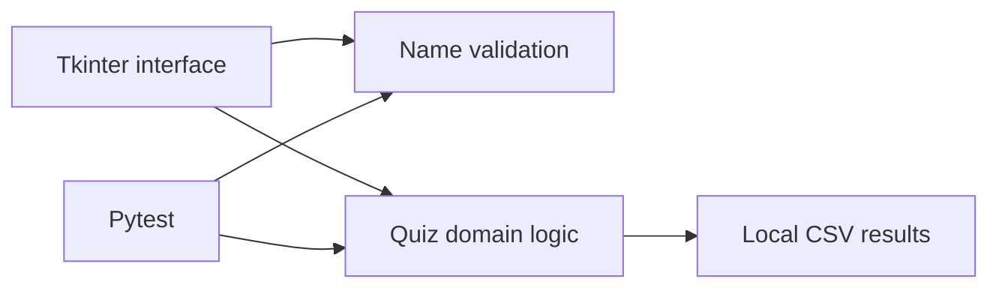

# Transport Operations Training Quiz

A desktop quiz application demonstrating how Python can support a simple training workflow. The project combines a Tkinter interface with separated domain logic, validation, CSV persistence, automated tests and continuous integration.

The scenarios are fictional and organisation-neutral. They are included to demonstrate the software and are **not operational guidance**.

## Highlights

- Multi-screen Tkinter interface
- Object-oriented quiz and question model
- Participant-name validation
- Automatic scoring and CSV result export
- Input and boundary validation
- Pytest test suite
- GitHub Actions continuous integration

## Architecture



The interface is kept separate from the quiz rules and validation functions. This makes the core behaviour testable without launching a desktop window.

## Run locally

Requires Python 3.11 or later.

```bash
python gui.py
```

Quiz results are written locally to `data/results.csv`. That generated file is excluded from version control.

## Run the tests

```bash
python -m pip install -r requirements-dev.txt
pytest
```

GitHub Actions runs the same test suite for pull requests and pushes to `main`.

## Possible next steps

- Randomise question order
- Store question content outside the source code
- Add an administrator results view
- Replace CSV persistence with a relational database
- Package the application as a desktop executable
